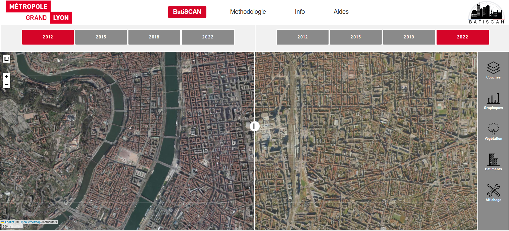

# BatiSCAN

Cette application a été créée par des étudiants du Master 2 Géographie Numérique de l’Université Lyon 2 et du Master 2 SENTINELLES de l’Université Lyon 3, dans le cadre d’un projet professionnel. Cette application s’inscrit dans le cadre d’une commande portée par les services Erasme et Données Métropolitaines de la Métropole de Lyon, à destination des étudiants des Masters Géonum et Sentinelles.


## Lien de l'application en live
[Lien Demo](https://batiscan.onrender.com/)

## Commanditaires :
- [Métropole de Lyon](https://www.grandlyon.com/)
- [Erasme](https://erasme.org/-Accueil-331-)

## Prestataire :
- [Master Géonum](https://mastergeonum.org/)
- [Master Sentinelles](https://facdeshumanites.univ-lyon3.fr/master-sante-environnement-informations-spatio-temporelles-sentinelles)

## Équipe :
- [Benirina Parfait RAFAMATANANTSOA](https://www.linkedin.com/in/benirina-parfait-rafamatanantsoa-1a2653270/)
- [Camille Roche-Autin](https://www.linkedin.com/in/camille-roche-autin-302868b2/)
- [Corentin Quesnel](https://www.linkedin.com/in/corentin-quesnel-873b8b332/)
- [Jules Chasson](https://www.linkedin.com/in/jules-chasson-1232a6194/)
- [Paul Goullencourt](https://www.linkedin.com/in/paul-g-047b971b1/)

Pour toute autre question, contactez [Master Géonum](https://mastergeonum.org/).


<div style="display: flex; justify-content: space-around; gap: 20px;">
  
  
  
  
</div>


---

## Installation

Pour installer ce projet, suivez ces étapes :

1. Clonez ce repository :

```bash
git clone https://github.com/MasterGeonum/2025_BatiSCAN.git
```
2. Allez dans le répertoire du projet :
```bash 
cd BatiSCAN
```
3. Installez les dépendances nécessaires :
```bash 
npm install
```

---
## Lancer le projet
Une fois les dépendances installées, vous pouvez démarrer le projet localement avec Vite.

### Pour démarrer l'application en mode développement :
```bash 
npm run start
```
Cela lancera le serveur de développement et vous pourrez accéder à l'application via 
```bash 
http://localhost:5173
```
### Pour servir l'application en mode production (après avoir construit le projet) :
1. Construisez le projet pour la production :
```bash 
npm run build
```

2. Lancez le serveur de prévisualisation en mode production :
```bash 
npm run serve
```
3. Accédez à l'application en mode production via:
```bash 
http://localhost:4173
```